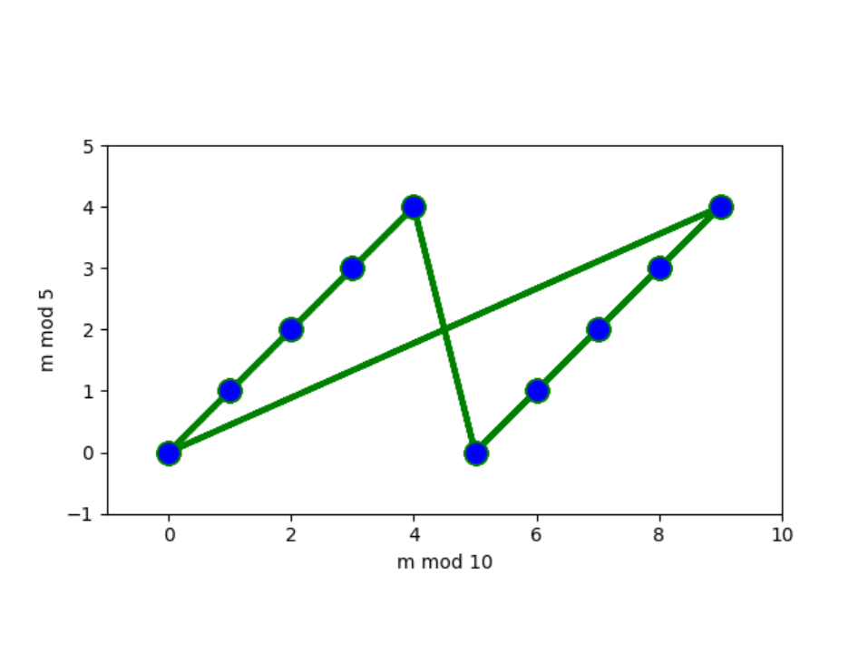
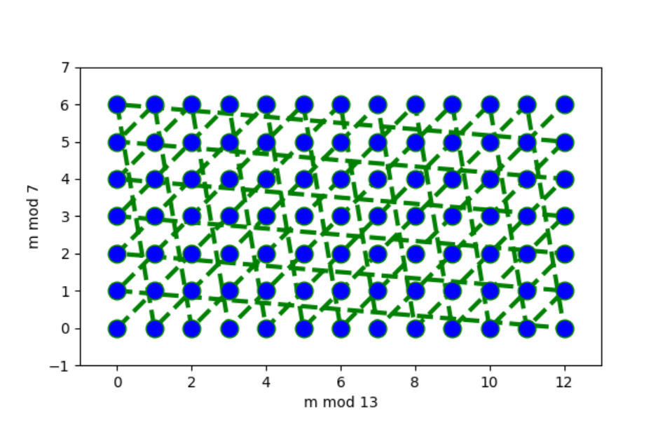

# Chinese Remainder Theorem

When dividing numbers $0,1,2,3,…$ by (say) $5$, we get remainders

$0,1,2,3,4,0,1,2,3,4,0,1,2,…:$ this repeats all the time. In general, $m$ and $m+5$ have the same remainder ($m≡m+5(mod5)$, their difference is divisible by $5$).

**What if we consider the remainders for two different modulo at the same time?**

First of all, we choose a pair like $2$ and $3$ for dividing a number for example $15$.

- The remainders modulo $2$ (i.e., $0$ and $1$) alternate (even values of $i$ alternate with odd values of $i$).

- The remainders modulo $3$ (i.e., $0,1,2$) appear in a $3$-loop ($0,1,2,0,1,2,…$)

- When we come to six, both cycles return to their original position (since $6$ is divisible both by $2$ and $3$, and then the pairs start to repeat, thus forming a loop of length $6$).

- All six possible combinations of remainders (two possible remainders modulo $2$ combined with three possible remainders modulo $3$) appear in this sequence (once per a $6$-loop).

Let us look at the column for $2$ and $4$: we see a cycle of length $4$ in this column formed by pairs $(0,0),(1,1),(0,2),(1,3)$ - and, indeed, $4$ is divisible both by $2$ and $4$, so we get again the pair $(0,0)$. Note that not all combinations of remainders appear in the cycle: for example, pair $(1,2)$ does not appear.

**Can you explain why this pair does not appear: why there are no m such that $m≡0(mod4)$ and $m≡1(mod6)$?**

Again, the reason is simple: numbers of the form $4u+0$ are **even**, while numbers of the form $6v+1$ are **odd**.

To understand the behavior of remainders, it is useful to look at bigger examples, and draw the pairs of remainders on a coordinate plane. This can be done with the following code (do not worry if you do not understand the options, they are needed to make nice plots).

```python
import matplotlib.pyplot as plt

a, b = 10, 5
n = a * b

plt.plot([i % a for i in range(n)], [i % b for i in range(n)],
         color='green', linestyle='dashed', linewidth=3,
         marker='o', markerfacecolor='blue', markersize=12)

plt.axis('square')
plt.xlim(-1, a)
plt.ylim(-1, b)
plt.xlabel(f'm mod {a}')
plt.ylabel(f'm mod {b}')

plt.savefig('crt-10-5.png')
```



In the first picture, the remainder modulo $10$ determines the remainder modulo $5$. Indeed, if $m=10k+r$, then $10k$ is divisible by $5$, so $mmod5=rmod5$.

A similar picture for $mmod13$ and $mmod7$ looks different:



Here we see that all pairs of remainders are possible. Why? This question is answered by the **Chinese remainder theorem**.

### **Theorem**

Let $p,q$ be coprime. Then the system of equations $$x=a (mod p)$$ $$x=b (mod q)$$

has a unique solution for $x$ modulo $pq$.

The reverse direction is trivial: given $ x \in \mathbb{Z}_{_{pq}}$ we can reduce $x$ modulo $p$ and $x$ modulo $q$ to obtain two equations of the above form.

The following is a general construction to find a solution to a system of congruences using the Chinese remainder theorem:

1. Compute $N=n_1 × n_2 × ⋯ × n_k$

2. For each $i=1,2,…,k$ compute $$ y{{_i}} = \frac{N}{n{{_i}}} = {n}_1 \cdot {n}_{2} + ⋯ + {n}_{_{i-1}} \cdot {n}_{_{i+1}} + ⋯ + n{{_k}} $$

3. For each $i=1,2,…,k$ compute $ z_i ≡ y_i^{-1} mod n_i$ using Euclid's extended algorithm ($z_i$ exists since $n_1,n_2,…,n_k$ are pairwise coprime).

4. The integer $ x = {\sum ^k}_{_{i=1}} a_i y_i z_i$ is a solution to the system of congruences, and $xmodN$ is the unique solution modulo $N$.

When a system contains a relatively small number of congruences, an efficient process exists to apply the Chinese remainder theorem.

**Solve the system of congruences**

> $$ x ≡ 1 mod 3 $$ $$ x ≡ 4 mod 5 $$ $$ x ≡ 6 mod 7 $$
> Take all the yi and construct the integer: $$ M = a_1M_1y_1 + a_2M_2y_2 + ... + a_rM_ry_r $$
> We can prepare our situation to this:
> $$ a_1 = 1 \quad a_2 = 4 \quad a_3=6$$
> $$ M_1 = 5 \cdot 7 \quad M_2 = 3 \cdot 7 \quad M_3=3 \cdot 5$$
> We wrote $ x_n^{-1}$ instead $y_n$ for inverse
> $$ x= 5 \cdot 7 \cdot 1 \cdot x_1^{-1} + 3 \cdot 7 \cdot 4 \cdot x_2^{-1} + 3 \cdot 5 \cdot 6 \cdot x_3^{-1}$$
> $$ \quad \quad \text{for mod 3} \quad \quad \text{ for mod 5} \quad \quad \text{ for mod 7}$$
> For find to general $x$ solve inverses of $x$ values
> $$ M_n \cdot x_n^{-1} = 1 \mod(m) $$ For $x_1^{-1}$: $$5 \cdot 7 \cdot x_1^{-1} ≡ 1\mod(3) $$ $$3 \cdot x_1^{-1} ≡ 1\mod(3) $$
> We can use <b>extended euclid algortihm</b> $$ 3 = 2 \cdot 1 + 1$$ $$ 1 = 3- 2\cdot 1$$ $$x_1^{-1} = -1 =2 $$ find all $x$ values like this:
> $$ x_2^{-1} = 1, \quad x_3^{-1} = 1$$ and combine together:
> $$ x= (5 \cdot 7 \cdot 1 \cdot 2 + 3 \cdot 7 \cdot 4 \cdot 1 + 3 \cdot 5 \cdot 6 \cdot 1)\mod(3 \cdot 5 \cdot 7)$$ $$ x=(70 + 84 + 90)\mod(105) $$ $$x=(244)\mod(105) $$ $$ x= (34)\mod(105) $$

<br/>

<details style="cursor: pointer;">
<summary>
  <b>Question-1</b> :&emsp; 
      A box contains gold coins.
      
<div style="display: flex; align-items: center; gap: 10px;">
    

<div>
<p>If the coins are equally divided among six friends, four coins are left over.</p>
<p>If the coins are equally divided among five friends, three coins are left over.</p>
<p>If the box holds the smallest number of coins that meets these two conditions, how many coins are left when equally divided among seven friends?</p>            
</div>

</div>

 <p>See answer ▼</p>

  </summary>

> <b>Answer</b> : 0
>
> First of all, mathematize the question. $$ x ≡4\mod(6), \quad \quad x ≡3\mod(5) $$ So, $$ x ≡y\mod(7) ?$$ We can prepare our situation
> $$ a_1 = 4, \quad a_2 = 3$$
> $$ M_1 = 5, \quad M_2 = 6$$
> $$ x= 5 \cdot 4 \cdot x_1^{-1} + 6 \cdot 3 \cdot x_2^{-1}$$
> $$ \quad \quad \text{for mod 6} \quad \text{for mod 5}$$
> For $x_1^{-1}$ and $x_2^{-1}$ : $$5 \cdot x_1^{-1} ≡ 1\mod(6) $$ $$6 \cdot x_2^{-1} ≡ 1\mod(5) $$ $$ x_1^{-1} = 5, \quad x_2^{-1} = 1 $$
> general equation: $$ x = (5\cdot 5 \cdot 4 + 6\cdot 3 \cdot 1)\mod(6\cdot 5)$$ $$ x = 118\mod(30)$$ $$ x = 28\mod(30)$$
> we found $28$ gold in our box. Now divide among seven friends $$28 ≡ y \mod(7)$$ $$0≡y\mod(7)$$
> Opps, zero coins left after divided our friends :)

</details>

### <b>Example</b>

Find $x$, if possible, such that $$2x ≡ 5 \mod(7)$$ $$3x ≡ 4 \mod(8)$$

<b>Solution</b> First note that $2$ has an inverse modulo $7$, namely $4$. So we can write the first equivalence as $x ≡ 4 · 5 ≡ 6 \mod(7)$.
Hence, we can multiply every side of equation with inverse of $2$. $$2 \cdot 4 \cdot x ≡ 5 \cdot 4 \mod(7) $$ $$8 \cdot x ≡ 20 \mod(7) $$ and we reached simple equation $$x ≡ 6 \mod(7) $$ do it same process for other $$ 3 \cdot 3 \cdot x ≡ 4 \cdot 3 \mod(8) $$ $$ x ≡ 4 \mod(8) $$
We can revise the question again and solve it like the previous ones. I left this to you :)

<br/>
<br/>
<br/>

<details style="cursor: pointer;">
<summary>
  <b>Question-1</b> :&emsp; 
      What are the last two digits of $49^{19}$ ?

 <p>See answer ▼</p>

  </summary>

> <b>Answer</b> : 49
>
> Observe that $100=25×4$ and $\gcd(25,4)=1$. Then by the Chinese remainder theorem, the value $x≡49^{19} \mod(100)$ is in correspondence with the solutions to the simultaneous congruences $$ x ≡ 49^{19} \mod(25)$$ $$ x ≡ 49^{19} \mod(4)$$ Now, $$ 49^{19} ≡ (-1)^{19} ≡ -1 \mod(25)$$ $$ 49^{19} ≡ (-1)^{19} ≡ 1 \mod(4)$$
> Then the Chinese remainder theorem gives the value $$ x ≡ ((-1)\cdot (4) \cdot (19) + (1) \cdot (25) \cdot (1))\mod(100) $$ $$ x ≡ (-76+25)\mod(100) $$
$$ x ≡ -51\mod(100) $$ $$ x ≡ 49\mod(100) $$
Therefore, the last two digits of $49^{19}$ are $49$. Note that the above system of congruences is obtained for any odd exponent of $49$, so the solution using the Chinese remainder theorem also gives that the last two digits of $49^k$ are $49$ for any positive odd value of $k$.

</details>
