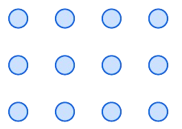

# Prime Numbers

You can easily arrange $12$ balls in three rows and four columns

<div style="text-align: center;">
    
</div>

This worked because $4 \cdot 3 = 12$. In other words, because $12$ can be represented as a product of two smaller numbers, $3$ and $4$.

The question to ask is: <b>"How many groups of $12$ apples are possible?"</b> $$(2,6)(6,2)(3,4)(4,3)$$

Note that we do not include <b>trivial</b> decompositions like $12=1×12=12×1$ (a rectangle with one row or one column).

On the other hand, $23$ does not have any <b>non-trivial</b> decompositions (only $1 × 23$ and $23×1$), meaning it is prime.

## Definition

&emsp; A prime number is a positive integer $p > 1$ that cannot be represented as the product of two smaller positive integers.

A number $p>1$ is prime if it does not have positive integer divisors except for $1$ and $p$.

Indeed, if $m=uv$ is composite where $u$ and $v$ are non-trivial divisors, then $u$ and $v$ are both smaller than $m$, making it impossible for either one to be equal to $1$. And if a number $m>1$ has some non-trivial divisor $d$, then for some positive integer $q$ we must have $m=dq$ by the definition of a divisor, and neither $d$ nor $q$ can be equal to $1$, so both must be smaller than $m$.

## Naive Approach - Trial Divison

&emsp; The most straightforward method to determine if a number is prime is through trial division. We divide the number by all integers from $2$ up to its square root. If none of these divisions result in a remainder of $0$, the number is prime.

```python
def is_prime_naive(num):
  """Checks if a number is prime using trial division."""
  if num <= 1:
    return False
  for i in range(2, int(num**0.5) + 1):
    if num % i == 0:
      return False
  return True
```

The provided Python function, <b>is_prime_naive</b>, efficiently determines whether a given integer is a prime number. It first handles the base case where the number is less than or equal to $1$, which is not prime. The function then iterates through potential divisors from $2$ up to the square root of the number.

If any divisor divides the number evenly, it's not prime and the function returns False. If the loop completes without finding a divisor, the number must be prime, and the function returns True. This optimization of checking only up to the square root is based on the mathematical property that if a number has a divisor greater than its square root, it must also have a corresponding divisor less than its square root.
