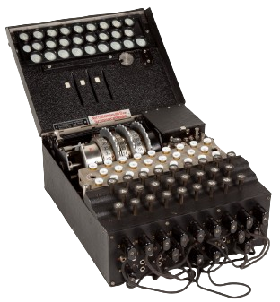
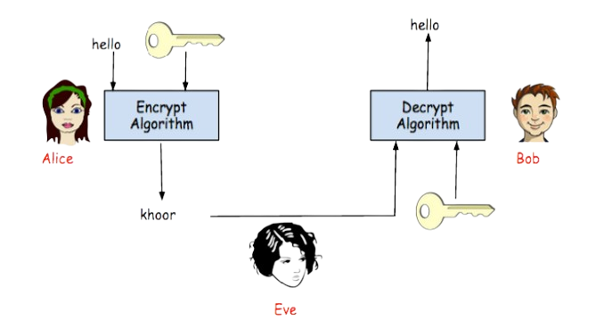
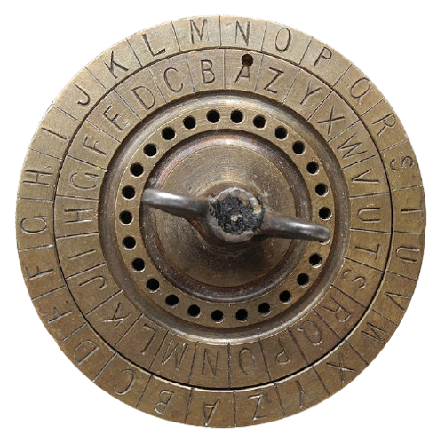
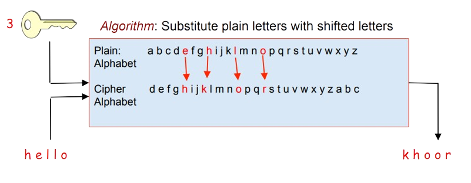

# History of Cryptography

&emsp; Cryptography made its greatest advancements during World War I and II, driven by the need for secure communication amidst rampant espionage. Early ciphers proved insufficient, and secure communication required frequently changing shared keys—an increasingly complex task as global communication expanded. This challenge led to the creation of the RSA cryptosystem, enabling secret key exchange without fear of eavesdropping. We will also explore common vulnerabilities in RSA implementations and conduct a few targeted attacks.

<div style="display: flex; justify-content: center;">
  
</div>
&emsp; The Enigma machine, a German invention with multiple rotors, played a key role in cryptography during World War I. In World War II, Alan Turing and his team created a computer to break Enigma codes. By testing rotor combinations and analyzing intercepted ciphertexts for patterns resembling English plaintext, they decrypted messages critical to the war effort. These developments influenced not just warfare but also modern technologies like blockchain, where cryptographic algorithms secure transactions and ensure data integrity.

After the war, cryptographic methods became crucial for global power, particularly in nuclear defense systems and computer networks. Early radar systems transmitted alerts through these networks, allowing swift decision-making. Universities soon adopted computer networks, paving the way for innovations like online commerce, messaging systems, and digital currencies. Today, secure communication methods form the backbone of technologies we rely on daily.

Alice and Bob, the traditional placeholders in cryptography, represent any two parties exchanging information securely. Eve, the eavesdropper, listens to everything sent between them.

<div style="display: flex; justify-content: center;">

</div>

To ensure privacy, Alice encrypts her plaintext message into ciphertext, which only Bob can decrypt. Various cipher systems enable this, balancing efficiency with security to outpace potential attackers like Eve.

# Caesar Encryption

&emsp; If the key is a cyclic shift of the alphabet is known as Caesar cipher. It is named after Julius Caesar, who used it for establishing secure communication. A key for such an encryption scheme can be generated using a physical device like the one shown below:

<div style="display: flex; justify-content: center;">

</div>

**Key:** Shift the alphabet by **N** letters to create cipher alphabet

In example on below, every letter is replaced by a letter three places further in the alphabet. Nowadays, it is not recommended to use Caesar cipher as it is too easy to crack it.

**Encryption**

<div style="display: flex; justify-content: center;">

</div>

**Decryption**

The reason why this cipher is easily breakable is that the space of possible keys is small. Indeed, there are only $26$ different cyclic shifts of the alphabet: the possible values of the shift are $0,1,…,25$. This makes it possible for Eve to enumerate all the keys and to decode using each of them.

```python
ciphertext = 'kyv wzmv sfozex nzqriuj aldg hlztbcp'
for shift in range(26):
    key = alphabet[shift:] + alphabet[:shift]
    print(decode(ciphertext))

# try and find plain text
```

# Substitution Ciphers

&emsp; Substitution cipher is one of the oldest and simplest. To use it, Alice and Bob share a private key that represents a permutation of the letters, e.g.,

_*jsuyfhkpicomxrqatlbvznewgd*_

To encode her message, Alice starts by aligning the key with the alphabet:

_*abcdefghijklmnopqrstuvwxyz*_

_*jsuyfhkpicomxrqatlbvznewgd*_

Then, she uses the resulting substitution table as follows: she replaces every letter $a$ in her message by $j$, every $b$ by $s$, and so on. For decoding, one uses the same substitution table with the two rows switched: $j$ is replaced by $a$, $s$ is replaced by $b$, and so on. It is particularly easy to implement this cipher in python:

```python
alphabet = 'abcdefghijklmnopqrstuvwxyz'
key =      'jsuyfhkpicomxrqatlbvznewgd'


def substitute(text, substitute_what, substitute_by):
    result = ''
    for symbol in text.lower():
        if symbol in substitute_what:
            result += substitute_by[substitute_what.index(symbol)]
        else:
            result += symbol

    return result


def encode(plaintext):
    return substitute(plaintext, alphabet, key)


def decode(ciphertext):
    return substitute(ciphertext, key, alphabet)


message = 'the quick brown fox jumps over the lazy dog'
code = encode(message)
print(code)
print(decode(code))
```

"The quick brown fox jumps over the lazy dog" is a well-known pangram, that is, a sentence containing all letters of the alphabet. For this reason, it is widely used for testing fonts.

When the key is not just a cyclic shift of the alphabet, but rather an arbitrary permutation of the alphabet, enumerating all keys is not that easy: the size of the space of all keys is $$26!=403 \space 291 \space 461 \space 126 \space 605 \space 635 \space 584 \space 000 \space 000$$

### Cracking Simple Substitution

&emsp;Substitution ciphers are not considered secure as they are vulnerable to frequency analysis attacks. Such attacks exploit the fact that some letter combinations appear more frequently in English texts than others: the letters $e,t,a,o$ are the most common; the word $the$ usually appears many times.

<div style="display: flex; justify-content: center;">

</div>

Did something catch your attention? $26!$ We don't need to try twice. We can solve the problem simply by assuming that the letter **z** in the encrypted text is equal to the letter **e**.

<br/>
<br/>
