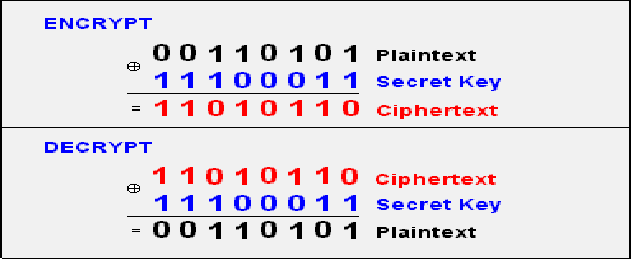
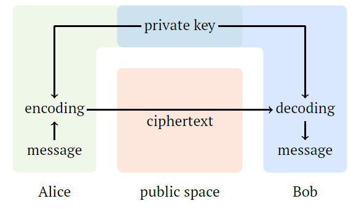

# One-Time Pad

This section focuses on an encryption scheme that is both invulnerable to frequency analysis and provably secure. In fact, it guarantees that an eavesdropper, Eve, gains no information from the intercepted ciphertext.

Imagine Alice needs to send a single bit of information to Bob, such as buy or sell, attack or retreat. They can agree in advance on a pair of text messages (e.g., cat and dog) to represent these options, along with their meanings. If Eve intercepts the message but doesn’t know the agreed code, the information remains completely inaccessible to her.

To explain in terms of bit operations, assume Alice’s message is a single bit $m$ ($0$ or $1$), and the private key $k$, known only to Alice and Bob, is also a single bit. The ciphertext $c$, transmitted over a public channel, is calculated as $c=m⊕k$, where $⊕$ represents $XOR$ (exclusive OR). For example, if $k=0$, the ciphertext equals the message ($c=m$). If $k=1$, the ciphertext is the reverse of the message ($c=m⊕1$). To decode, Bob simply computes $m=c⊕k$.

**Extending to Multi-Bit Messages**

The one-time pad can be generalized to longer messages. To encode a bit string, each bit is XORed with a corresponding bit from the private key. For example, if Bob sends the bit string $1000110100$ and the key is $1111111111$, the ciphertext becomes $0111001011$, where each plaintext bit is XORed with the respective key bit. Decoding reverses the operation: $m_i=c_i ⊕k_i$.

**Limitations of a Single-Bit Key**

While the one-time pad is theoretically secure, it requires keys as long as the messages themselves. Using a single-bit key repeatedly, as demonstrated, is insecure. Eve could try both possible keys ($0$ and $1$) to decode the ciphertext. For example, if Bob encrypts a PIN code, Eve could easily guess it by testing both keys.

**The Perfect Security of One-Time Pads**

To achieve true security, Alice and Bob must use a unique, secret key for each bit of the message. For a message $m_1 ,m_2 , … ,m_n$ , they agree on a private key $k_1 ,k_2,…,k_n $ and compute $c_i=m_i⊕k_i$ for each bit. This approach ensures that Eve gains no information from the ciphertext. Regardless of the intercepted data, all $2^n$ possible original messages appear equally likely to Eve.

This scheme, known as a symmetric private-key method, is illustrated below: encoding and decoding are symmetric, and the private key is shared between Alice and Bob. Patented in 1919, the one-time pad remains a cornerstone of cryptographic history, though its practical use is often limited by the need for key management.
