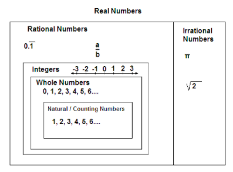

# Numbers

Most of the concepts we learn in math seem pretty far removed from our everyday lives. We might think, "Who really needs to know about calculus or trigonometry?" But the truth is, even the most basic mathematical ideas have their roots in real-world problems. Let's go back to the very beginning and see how it all started...

Once upon a time, in a big, dark cave, there lived a caveman named Grog. Grog had a bunch of sheep. He wanted to know how many sheep he had, so he started counting, $1,2,3...$ And just like that, he discovered counting numbers or natural numbers ($N$). Pretty cool, huh?

But then, a sneaky caveman named Ug came along and stole some of Grog’s sheep! Ug told Grog that he needed to give him 3 more sheep. Grog was upset, but he started thinking. If he wanted to have 3 sheep left, he needed to have 6 sheep in total to give 3 to Ug. This is how Grog discovered negative numbers ($...-3,-2,-1$) and integers ($...-3,-2,-1,0,1,2,3...$)

Later, Grog had 3 delicious berries. He wanted to share them with his family of 4. But wait, he couldn’t divide 3 berries into 4 equal parts! That’s when Grog discovered rational numbers $R$(fractions). Even though he couldn’t share them equally, he learned that sometimes, numbers can be broken into smaller pieces.

Number theory is all about studying whole numbers and how they work together. It started out with practical uses, but as it got more complex, it seemed less useful in real life.

    

After interesting researches about cryptography and electric fiels, number theory, even the really complicated parts, is super important for modern cryptography. And cryptography is a big deal in our lives. It's what keeps our emails, messages, online shopping, and the whole internet safe.
