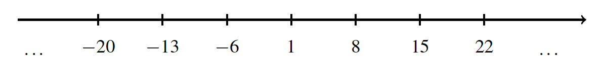

# Remainders

In our previous exploration of integer division, we encountered situations where one integer couldn't be perfectly divided by another. This led us to the concept of divisibility. Now, let's delve deeper into the mechanics of integer division when it's not exact.

### Defination

Given two integers, $a$ and $b$ (where $b$ is positive), the division with remainder of $a$ by $b$ is a pair of integers, $q$ (quotient) and $r$ (remainder), satisfying the following conditions:

$$ a = q \cdot b + r$$
$$ 0 \leq r < b $$

Think of $a$ as a collection of objects. We want to divide these objects into groups of size $b$. The quotient, $q$, represents the number of complete groups we can form, while the remainder, $r$, is the number of objects left over after forming the groups.

- $ 15 / 4 = 3 \cdot 4 + 3 $ , So, $q=3$ and $r=3$

- $ -13 / 3 = -5 \cdot 3 + 2 $ , So, $q=-5$ and $r=2$

- $ 12 / 4 = 3 \cdot 4 + 0 $ , So, $q=3$ and $r=0$ (in this case, a is divisible by b, $b\mid a$).

```python
def divide_with_remainder(a, b):
  "Divides a by b and returns the quotient and remainder."
  q = a // b
  r = a % b
  return q, r

# Examples
a, b = 15, 4
q, r = divide_with_remainder(a, b)
print(f"{a} = {q} * {b} + {r}")
```

### Algorithms

If we consider numbers that have the same remainder when divided by $a$ specific number, we can observe interesting patterns. For example, numbers that leave a remainder of $1$ when divided by $7$ have the form:
$$ a = 7 \cdot q + 1 $$

where $q$ is any integer. This pattern can be extended to any divisor and any remainder. For example, this pattern creates own group by given $q$. For positive $q=1,2,3..$ we get sequence $a=8,15,22..$ For negative $q=-1,-2,-3...$ we get sequence $a=-6,-13,-20...$

Overall, this is our group would be like this:

<div style="text-align: center;">
    
</div>

### Exercise

<details style="cursor: pointer;">
<summary>
  <b>Question</b> : Is it true that for any four integers $a,b,c,d$ there are two of them whose difference is divisible by 3?
    <br><br>
    <input type="radio" id="a" name="question-1" value="yes">
    <label for="a">Yes, there are always two numbers with this property</label>
    <br><br>

<input type="radio" id="b" name="question-1" value="no">
  <label for="b">No, this is not always the case</label>

 <p>See answer ▼</p>

  </summary>

> <b>Answer</b> : A
>
> There are only three possible remainders when dividing by
> $3$.So, among four integers $a,b,c,d$ there are two with the same remainder when divided by $3$. The difference of these two numbers is always divisible by $3$.

</details>

### Conclusion

Division with remainder is a fundamental concept in number theory that allows us to understand the relationships between integers and their divisibility properties.

It has applications in various areas of mathematics and computer science.
